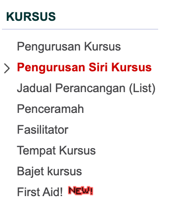
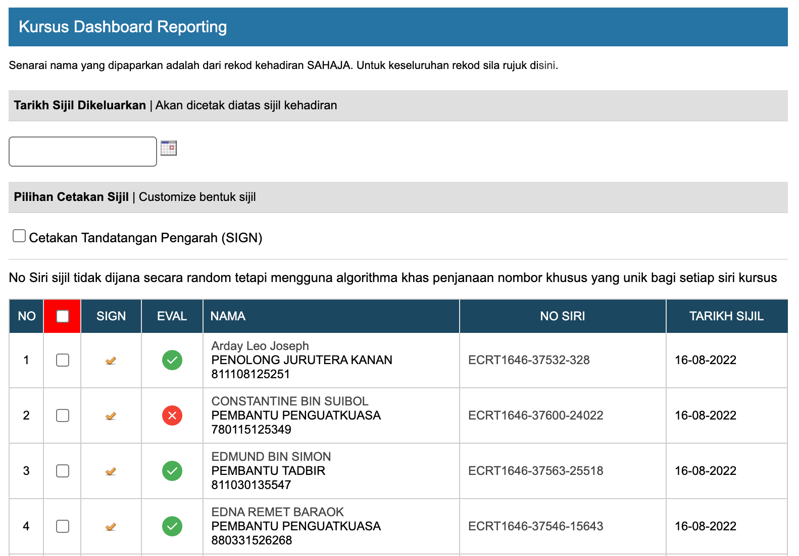

# Kaedah Jana Sijil Kursus (Kemaskini)

## Pengenalan Sijil Akademi

Penjanaan sijil kursus adalah untuk menggantikan penggunaan sijil manual yang tidak dikeluarkan oleh Akademi JPJ lagi

Klik pada pengurusan siri kursus.

Kemudian klik pada Menu Jana Sijil Kehadiran. Maklumat seperti berikut akan dipaparkan

Paparan Jana Sijil dipaparkan. 

1. Pilih Tarikh Sijil DIkeluarkan
2. Klik button Check Box **Cetakan Tadatangan Pengarah (SIGN)**
3. Klik pada button Check Box **nama peserta**
4. Klik Button **Jana Sijil Kehadiran Kursus**
5. Siap!!! Sijil peserta telah di jana

