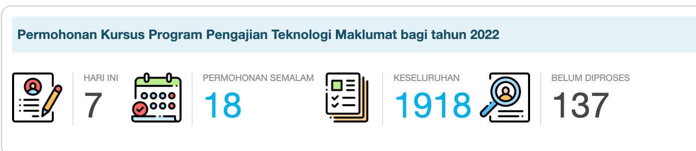

# Welcome to MkDocs

Ini adalah text di bawah header untuk pengenalan bagi sesuatu manual

##Tips Kedua

Ini pula untuk buat bold **bold** baru akan jadi bold. Untuk letakkan URL google:
 
    http://www.google.com

[http://www.google.com](http://www.google.com)

##ini subheader ketiga

1. List1
2. List2
3. List3

Kena satu para dekat sini untuk asing kalau tidak dia continue

* Bintang 1
* Bintang 2

For full documentation visit [mkdocs.org](https://www.mkdocs.org).

## Commands

* `mkdocs new [dir-name]` - Create a new project.
* `mkdocs serve` - Start the live-reloading docs server.
* `mkdocs build` - Build the documentation site.
* `mkdocs -h` - Print help message and exit.

## Project layout

    mkdocs.yml    # The configuration file.
    docs/
        index.md  # The documentation homepage.
        ...       # Other markdown pages, images and other files.
